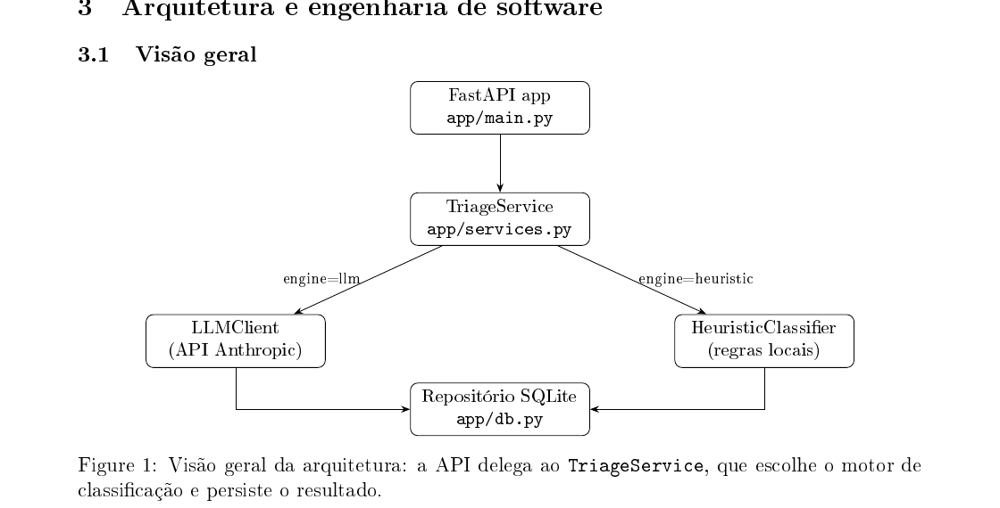
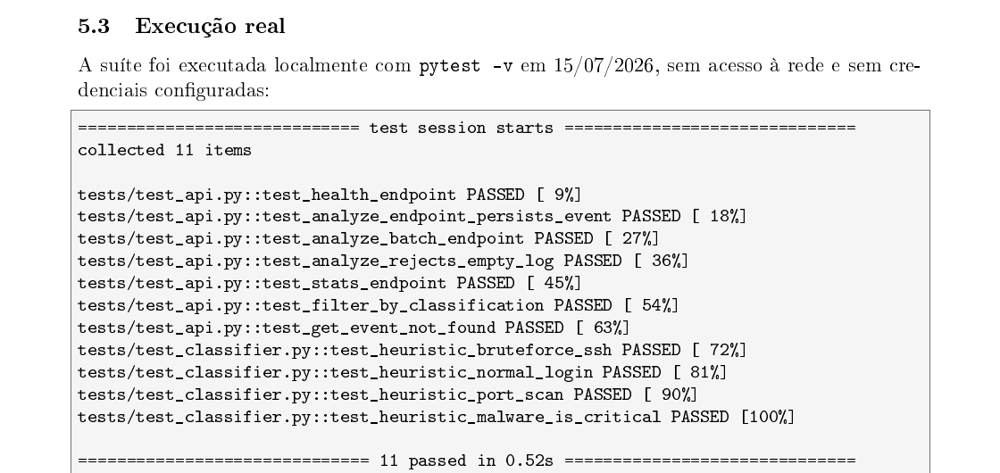
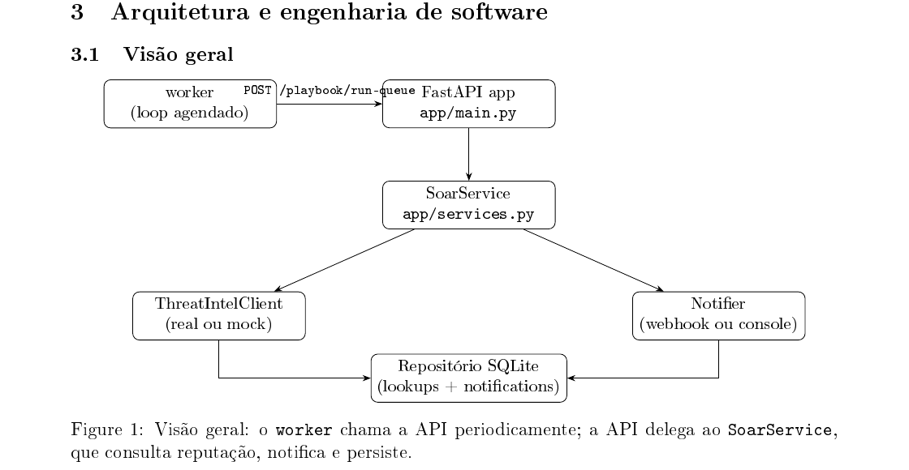
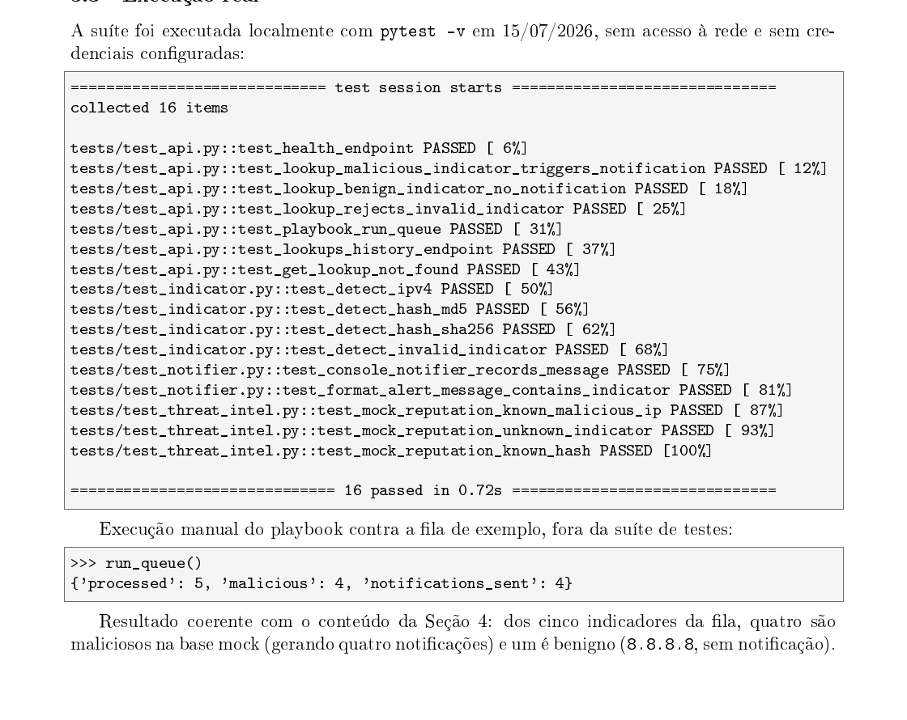

# IA Aplicada a Cibersegurança — Portfólio

Esta pasta reúne dois projetos de portfólio pessoal explorando IA aplicada a segurança
e automação de integração entre ferramentas de SOC (Security Operations Center).

Cada projeto é autocontido (código, documentação de engenharia de software, testes e
Docker), na sua própria pasta.

## Projetos

### 1. [`projeto-1-agente-triagem-logs`](projeto-1-agente-triagem-logs)

Agente de IA que classifica logs de segurança (SSH, firewall, EDR) como
suspeito/normal/crítico, resume o evento e sugere uma ação. Usa Claude quando há chave
de API configurada, ou um classificador heurístico local caso contrário — sempre
funcional, sempre testável. Roda em `http://localhost:8001`.

### 2. [`projeto-2-mini-soar`](projeto-2-mini-soar)

Mini SOAR que consulta a reputação de IPs/hashes suspeitos (AbuseIPDB/VirusTotal, com
fallback mock) e envia alertas para Slack/Discord (ou registra localmente em modo mock),
com um worker que reexecuta o playbook periodicamente. Roda em `http://localhost:8002`.

## Recortes dos relatórios técnicos

Cada projeto tem um relatório técnico completo em PDF (`docs/relatorio-tecnico.pdf`).
Os recortes abaixo — tirados diretamente desses PDFs — resumem a arquitetura e a
evidência de teste de cada um, sem precisar abrir nenhum documento.

### Projeto 1 — Agente de triagem de logs



> **Decisão de arquitetura — motor duplo (LLM + heurístico).** Com `ANTHROPIC_API_KEY`
> configurada, o serviço usa o Claude de verdade; sem ela, cai automaticamente para um
> classificador heurístico local — mesma interface de saída, troca transparente para
> quem consome a API. Resultado: 100% demonstrável offline e sem custo, e passa a usar
> IA real assim que uma chave é adicionada ao `.env`, sem alteração de código.



11/11 testes automatizados passando, 91% de cobertura de código (100% nos módulos
determinísticos — `db`, `models`, `config`; menor apenas no cliente do LLM, por não
haver credenciais reais nos testes — trade-off documentado no relatório).

### Projeto 2 — Mini SOAR



> **Worker como serviço Docker separado, em vez de `cron` dentro da imagem da API.**
> Funcionalmente equivalente a um cron job, mas mais simples de observar
> (`docker compose logs worker`) e de testar isoladamente — mesmo princípio de motor
> duplo (real + mock) aplicado tanto à consulta de reputação quanto ao envio de alertas.



16/16 testes automatizados passando, 90% de cobertura de código, e uma execução manual
do playbook contra a fila de exemplo: 5 indicadores processados, 4 maliciosos
corretamente notificados, 1 benigno (`8.8.8.8`) sem notificação.

## Como rodar tudo de uma vez

```bash
./run-all.sh   # sobe os dois projetos (cada um como um projeto Compose independente)
./stop-all.sh  # derruba os dois
```

- API 1 (triagem de logs): http://localhost:8001/docs
- API 2 (mini SOAR): http://localhost:8002/docs

Cada projeto também roda isoladamente — `cd` na pasta do projeto e `docker compose up
--build -d`. Ver o `README.md` de cada pasta para instruções específicas, exemplos de
uso via `curl` e como rodar os testes automatizados
(`docker compose run --rm api pytest -v` dentro de cada pasta).

## Engenharia de software

Cada projeto documenta, na sua pasta `docs/`:
1. **Requisitos** — funcionais, não funcionais, atores, casos de uso e critérios de aceite.
2. **Arquitetura e design** — módulos, decisões de arquitetura (com contexto/consequência),
   modelo de dados e contrato de API.
3. **Plano de testes** — casos de teste e definition of done.

Ambos os projetos seguem o mesmo princípio de design: **todo componente externo (LLM,
threat intel, webhook de notificação) tem um fallback local determinístico**, para que o
sistema fique 100% demonstrável e testável sem exigir credenciais pagas de terceiros —
e passe a usar os serviços reais automaticamente assim que uma chave for configurada em
`.env`, sem alteração de código.
